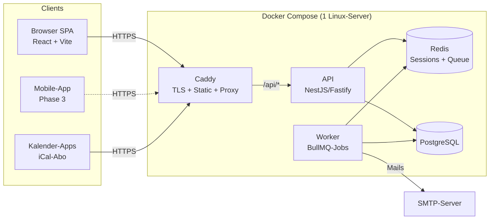

# ServeFlow

**Self-hosted Diensteinteilung und Gottesdienstplanung für Kirchgemeinden** – eine
Open-Source-Alternative zu Elvanto und Planning Center Services.

> ⚠️ Status: in aktiver Entwicklung (Phase 1 / MVP). Noch nicht produktionsreif.

## Warum ServeFlow?

- **Self-hosted:** Deine Mitgliederdaten bleiben auf deinem Server. Mitgliedschaft in
  einer Kirchgemeinde ist eine besondere Kategorie personenbezogener Daten
  (Art. 9 DSGVO / CH revDSG) – ServeFlow behandelt Datenschutz als Kernanforderung.
- **API-first:** Das Web-Frontend nutzt ausschließlich die dokumentierte REST-API
  (OpenAPI, Swagger UI unter `/api/docs`). Eine spätere Mobile-App braucht keine
  Backend-Änderungen.
- **Zweisprachig:** Deutsch (Default) und Englisch, i18n von Anfang an.

## Architekturübersicht



Alle Komponenten laufen per Docker Compose auf einem einzelnen Linux-Server
(z. B. Hetzner, Ubuntu 24.04). Caddy übernimmt TLS (Let's Encrypt) automatisch.

## Quickstart (lokale Entwicklung)

Voraussetzungen: Node ≥ 22, pnpm ≥ 10, Docker.

```bash
git clone <repo-url> && cd serveflow
cp .env.example .env                       # Defaults funktionieren für dev
pnpm install
docker compose -f docker/docker-compose.dev.yml up -d   # Postgres, Redis, Mailpit
pnpm --filter @serveflow/api prisma:migrate             # Migrationen + Client
pnpm --filter @serveflow/api prisma:seed                # Demo-Daten (30 Personen, 4 Teams, 8 Termine)
pnpm dev                                                # API :3000 + Web :5173
```

- Web-App: http://localhost:5173 – Login `admin@example.org` / `admin1234!` (Seed)
- API-Doku (Swagger): http://localhost:3000/api/docs
- Mailpit (abgefangene Mails): http://localhost:8025

## Produktion (Docker Compose)

Siehe [`docker/docker-compose.yml`](docker/docker-compose.yml) – referenziert
versionierte Images aus der GitHub Container Registry. Update auf dem Server:

```bash
docker compose pull && docker compose up -d
```

Details, Env-Var-Referenz und Backup/Restore: [docs/](docs/)
– wird mit dem Release-Workflow (Modul 10) finalisiert.

## Env-Var-Referenz

Siehe [`.env.example`](.env.example) – jede Variable ist dort kommentiert.

## Sicherheit & Datenschutz

- Feingranulares RBAC mit **serverseitiger Field-Level-Sichtbarkeit** (Mitglieder sehen
  von anderen nur Name/Foto; Teamleiter sehen Kontaktdaten nur eigener Teammitglieder)
- Append-only **Audit-Log** (wer hat wann welche Personendaten angesehen/geändert/exportiert)
- **Betroffenenrechte:** Datenexport pro Person (JSON/CSV), vollständige Löschung,
  Anonymisierung historischer Pläne
- Argon2id-Passwort-Hashing, TOTP-2FA, kurzlebige Single-Use-Tokens für Zu-/Absagen,
  applikationsseitig verschlüsselte Notizfelder (AES-256-GCM)
- Threat Model und OWASP-Checkliste: [docs/security.md](docs/security.md)
- Backup-Konzept (verschlüsselt, `pg_dump` + `age`): [docs/backup-restore.md](docs/backup-restore.md)

### Empfohlene GitHub-Repo-Einstellungen (Betreiber des Quell-Repos)

- **Branch Protection** für `main`: PRs nur bei grünem CI mergen
  (Settings → Branches → Require status checks: `ci`)
- **Secret Scanning + Push Protection** aktivieren
  (Settings → Code security and analysis)

## Lizenz

ServeFlow ist unter der **GNU AGPL-3.0** lizenziert (siehe [LICENSE](LICENSE)).

**Dual-Licensing:** Kommerzielle Nutzung außerhalb der AGPL-Bedingungen (z. B. Betrieb
als proprietärer SaaS ohne Offenlegung von Änderungen) erfordert eine separate
kommerzielle Lizenz. Kontaktiere die Maintainer für Konditionen.

## Mitmachen

Siehe [CONTRIBUTING.md](CONTRIBUTING.md).
